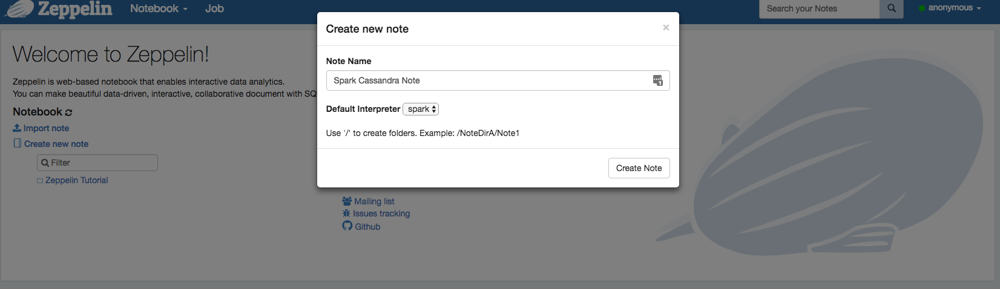
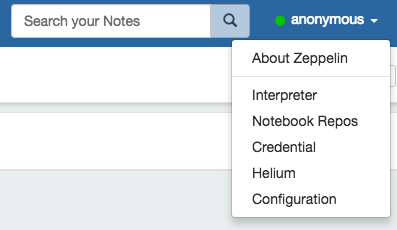
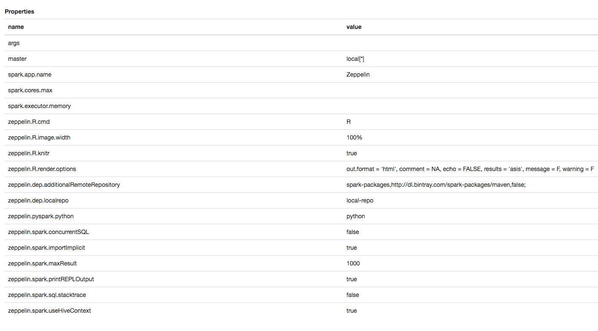
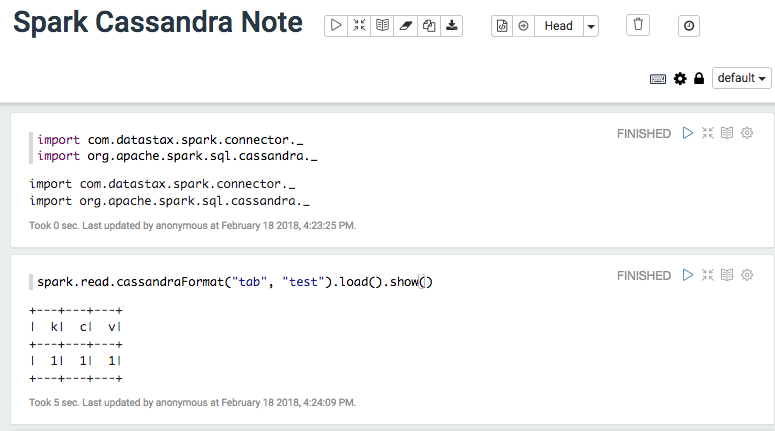

## Working with Zeppelin

### Set up Zeppelin

    tar -xvf zeppelin-0.7.3-bin-netinst.tgz
    
Set SPARK_HOME for Zeppelin to our spark directory
Edit zeppelin-0.7.3-bin-netinst/conf/zeppelin-env.sh
    
    export SPARK_HOME="/Users/russellspitzer/SparkInstalls/spark-2.2.1-bin-hadoop2.7" ## Replace this with your install directory

    
#### Start Zeppelin   
    
    ./zeppelin-0.7.3-bin-netinst/bin/zeppelin.sh
    
### Zeppelin Home Screen

[Local Zeppelin](http://localhost:8080/#/)

* Name is just something personal to identify the notebook for us
* Interpreter is the code execution engine used for snippets

### Setting up the Interpreter

Important for us

* master : The Spark Resource manager used for our Application

### Go over some basics with Dataframes

[Dataframe Notebook](notebooks/Spark%20Cassandra%20Note.json)

### Zeppelin Challenges

[Challenges Notebook](notebooks/Spark%20Cassandra%20Challenges.json)